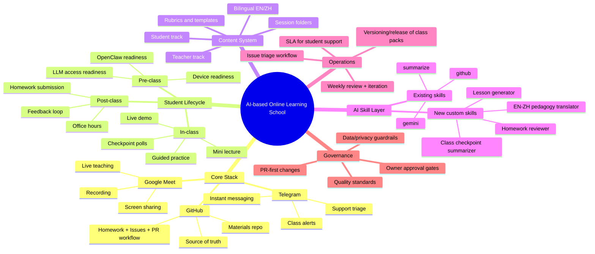

# TASK.md — Closed-claw Project Workflow (Ralph Loop Style)

## 1) Goal
Create a reliable, restart-safe, privacy-safe workflow so Sarah can keep progressing on issues with minimal supervision.

---

## 2) Operating Policy (Workflow First)

### A. GitHub Issue First (CRITICAL)
Before taking action on any item in the Tasks list section, **create a GitHub issue first** and then start work under that issue.
- **If you pick an existing task-list item to work on**:
  1. Create a GitHub issue for it (or confirm one already exists).
  2. Add the issue link/ID back into `TASK.md`.
  3. Only then begin implementation.
- **If a new problem/task arises during work**:
  1. Create a GitHub issue first.
  2. Then proceed with the work under that new issue.
  3. Update `TASK.md` to reflect the new item + issue link.
- **Sync Rule**: `TASK.md` must stay synced with GitHub. Every in-progress or planned task should have a corresponding GitHub issue. Close or mark completed tasks in `TASK.md` when the GitHub issue is closed.

### B. Scope Gate (MUST run first each cycle)
1. Detect chat context:
   - **Group chat** → public-safe mode only (no personal memory/details)
   - **Direct/private work session** → full project execution mode
2. Reject/redirect sensitive tasks if context is group and content is private.

### C. Ralph Loop Cycle (one issue per cycle)
1. **Pick next item** from backlog (`TASK.md` queue below)
2. **Create/update branch** for that single item
3. **Implement** smallest shippable change
4. **Run checks** (tests/lint/build as available)
5. **Commit + push** with clear message
6. **Open or update PR**
7. **Post concise status**
8. **Persist state** in files (`TASK.md`, optional `STATUS.md`) so restart can resume
9. Repeat next cycle

---

## 3) Project Mind Map

---

## 4) Assignment Split
- **Sarah lead:** Epics A, C, E (pedagogy, architecture, skill design)
- **Aether assist/execute:** Epics B, D, parts of E implementation
- **Randy approval/steer:** Milestones, priorities, release gates

---

## 5) Working Queue

### DONE
- [x] **Define and finalize this workflow** with Randy (owner approval)
- [x] **Issue #5** — Implement Student-facing delivery architecture (EN/ZH)
- [x] **PR #11** — Initialize roadmap and move TASK.md to ai-native-school/
- [x] **Issue #9** — Set up Google Drive folder for classroom infrastructure
- [x] **Epic C-1** — Define Bilingual Content Standard [#14](https://github.com/renshangh/classes/issues/14)
- [x] **Epic B-1** — Define Telegram Student UI & Interaction Model [#18](https://github.com/renshangh/classes/issues/18)
- [x] **Epic C-2** — Define Standard Lesson Skeleton [#17](https://github.com/renshangh/classes/issues/17)

- [x] **Build Lesson 01** — Introduction to AI-Native School curriculum [#20](https://github.com/renshangh/classes/issues/20)
- [x] **Setup Support Triage** — Implementation of Telegram student support bot [#21](https://github.com/renshangh/classes/issues/21)
- [x] **Issue Templates** — GitHub templates for homework/stuck/improvement [#25](https://github.com/renshangh/classes/issues/25)
- [x] **Assignment & Rubric Template** — Standard format for Sarah/Aether grading [#33](https://github.com/renshangh/classes/issues/33)
- [x] **Teacher/Student Pattern** — Separation of instructor guidance and handout [#34](https://github.com/renshangh/classes/issues/34)
- [x] **Learning KPIs & Process** — KPIs and review process defined [#39](https://github.com/renshangh/classes/issues/39)

- [x] **AI Skill Matrix Audit** — Audit of current skills and gap analysis for HW Reviewer & Lesson Gen [#26](https://github.com/renshangh/classes/issues/26)

### IN_PROGRESS
- [ ] **QA Simulation: Pilot Lesson 01** — Sub-agent persona test for content delivery and interaction [#46](https://github.com/renshangh/classes/issues/46)
  *   **Bugs Found**: [#48](https://github.com/renshangh/classes/issues/48)
- [ ] **Lesson Generator Skill (E-3)** — Implementation of EN/ZH lesson pack generation [#36](https://github.com/renshangh/classes/issues/36)
- [ ] **Class Insights Skill (E-4)** — Implementation of poll/blocker summarization [#37](https://github.com/renshangh/classes/issues/37)

### FUTURE
- [ ] **AI Instructor Integration** — Transitioning from bot assistant to primary teaching delivery role.
- [ ] **Dynamic Curriculum Adaptation** — Real-time content adjustment based on student checkpoint data.

### EPIC H – AI Pedagogy & Auto-Instruction
| # | Issue Title | Description / Acceptance Criteria | Labels |
|---|-------------|-----------------------------------|--------|
| [ ] H-1 | `Bot-Teacher Persona` | Define the voice, tone, and empathy-protocol for the autonomous bot teacher. | `pedagogy`, `epic-H` |
| [ ] H-2 | `Lecture-to-Content Automation` | Flow to convert raw developer lectures into the Bilingual Side-by-Side standard. | `automation`, `epic-H` |

---

## 6) Detailed Roadmap (Epics A–F)

### Epic A – Teaching Delivery Operating System
| # | Issue Title | Description / Acceptance Criteria | Labels |
|---|-------------|-----------------------------------|--------|
| [x] A-1 | `Runbook: Live class workflow` [#23](https://github.com/renshangh/classes/issues/23) | Document procedures (check-ins, start-up, wrap-up). Include Telegram & Google Meet steps. | `process`, `epic-A` |
| [ ] A-2 | `Runbook: Demo protocol` [#24](https://github.com/renshangh/classes/issues/24) | Define happy-path demo flow + failure-recovery steps. Checklist for instructors. | `process`, `demo`, `epic-A` |
| [ ] A-3 | `Runbook: Exercise protocol` [#24](https://github.com/renshangh/classes/issues/24) | Template for timed labs, pass-criteria, and submission mechanics. | `process`, `exercise`, `epic-A` |
| [ ] A-4 | `Runbook: In-class issue triage` [#28](https://github.com/renshangh/classes/issues/28) | Outline how to capture student issues and resolve in real time. SLA ≤ 5 min. | `process`, `triage`, `epic-A` |

### Epic B – Student Experience System
| # | Issue Title | Description / Acceptance Criteria | Labels |
|---|-------------|-----------------------------------|--------|
| [ ] B-1 | `Checklist: Pre-class readiness` [#29](https://github.com/renshangh/classes/issues/29) | Technical + account + LLM readiness checklist. Telegram reminder bot. | `student-exp`, `epic-B` |
| [ ] B-2 | `Template: Post-class reinforcement loop` [#30](https://github.com/renshangh/classes/issues/30) | Template for homework reminders, feedback, and office-hour scheduling. | `template`, `epic-B` |
| [ ] B-3 | `Form: Stuck-protocol issue template` [#31](https://github.com/renshangh/classes/issues/31) | GitHub issue template for students who get “stuck”. | `issue-template`, `epic-B` |
| [ ] B-4 | `Tracker: Student progress board` [#32](https://github.com/renshangh/classes/issues/32) | GitHub Project board with status labels (e.g., `feedback-given`). | `project-board`, `epic-B` |

### Epic C – Content Architecture
| # | Issue Title | Description / Acceptance Criteria | Labels |
|---|-------------|-----------------------------------|--------|
| [x] C-1 | `Standard: Bilingual format` [#14](https://github.com/renshangh/classes/issues/14) | Define markdown schema for side-by-side EN/ZH sections. | `content`, `bilingual`, `epic-C` |
| [ ] C-2 | `Template: Lesson skeleton` [#17](https://github.com/renshangh/classes/issues/17) | Lesson folder structure (README, slides, code, teacher-notes). | `template`, `epic-C` |
| [ ] C-3 | `Template: Assignment & rubric` [#33](https://github.com/renshangh/classes/issues/33) | Markdown assignment template + rubric table for Homework Reviewer skill. | `template`, `epic-C` |
| [ ] C-4 | `Pattern: Teacher-vs-student handouts` [#34](https://github.com/renshangh/classes/issues/34) | Split instructor guidance from student material. | `pattern`, `handouts`, `epic-C` |

### Epic D – GitHub Workflow + Automation
| # | Issue Title | Description / Acceptance Criteria | Labels |
|---|-------------|-----------------------------------|--------|
| [ ] D-1 | `Issue template: Homework submission` [#25](https://github.com/renshangh/classes/issues/25) | GitHub issue template for students to submit homework. | `issue-template`, `epic-D` |
| [ ] D-2 | `Issue template: Blocker / help request` [#25](https://github.com/renshangh/classes/issues/25) | Template for students to raise blockers during class. | `issue-template`, `epic-D` |
| [ ] D-3 | `PR template: Content checklist` [#35](https://github.com/renshangh/classes/issues/35) | PR template enforcing grammar, bilingual check, rubric alignment. | `pr-template`, `epic-D` |
| [x] D-4 | `Label taxonomy` | Create set of labels (e.g., `student-help`, `content-update`). | `labels`, `epic-D` |
| [x] D-5 | `Milestone scheme` [#12](https://github.com/renshangh/classes/issues/12) | Define milestones for class releases (v1.0, v1.1, …). | `milestones`, `epic-D` |

### Epic E – AI Skills Roadmap (OpenClaw)
| # | Issue Title | Description / Acceptance Criteria | Labels |
|---|-------------|-----------------------------------|--------|
| [ ] E-1 | `Skill matrix: Current vs needed` [#26](https://github.com/renshangh/classes/issues/26) | Audit existing skills and list gaps (Homework Reviewer, Lesson Gen). | `analysis`, `epic-E` |
| [ ] E-2 | `Skill: Homework reviewer` [#26](https://github.com/renshangh/classes/issues/26) | Implement skill to receive PR, run rubric checks, post feedback. | `skill`, `homework`, `epic-E` |
| [ ] E-3 | `Skill: Lesson pack generator` [#36](https://github.com/renshangh/classes/issues/36) | Build skill to produce EN/ZH lesson folders from high-level outline. | `skill`, `generation`, `epic-E` |
| [ ] E-4 | `Skill: Class insights summarizer` [#37](https://github.com/renshangh/classes/issues/37) | Aggregate checkpoint polls and blockers for the instructor. | `skill`, `insights`, `epic-E` |
| [ ] E-5 | `Skill: EN-ZH Pedagogy translator` | Translation skill tuned for educational content. | `skill`, `pedagogy`, `epic-E` |
| [ ] E-6 | `Process: AI change-watch` [#38](https://github.com/renshangh/classes/issues/38) | Monthly review to capture new LLM models or OpenClaw updates. | `process`, `epic-E` |

### Epic F – Quality & Future-Proofing
| # | Issue Title | Description / Acceptance Criteria | Labels |
|---|-------------|-----------------------------------|--------|
| [ ] F-1 | `KPI definition: Learning metrics` [#39](https://github.com/renshangh/classes/issues/39) | Completion rate, unblock time, homework quality score. | `metrics`, `quality`, `epic-F` |
| [ ] F-2 | `Review: Curriculum freshness` [#40](https://github.com/renshangh/classes/issues/40) | Recurring monthly audit for outdated content. | `recurring`, `review`, `epic-F` |
| [ ] F-3 | `Release process: Versioned packs` [#41](https://github.com/renshangh/classes/issues/41) | Document how to tag releases (v1.0, v1.1…) and generate notes. | `release`, `versioning`, `epic-F` |
| [ ] F-4 | `Pilot: New AI tool integration` [#42](https://github.com/renshangh/classes/issues/42) | Design pilot process for adding new AI tools to the school stack. | `pilot`, `epic-F` |

### Epic G – Marketing Strategy & Outreach (MOVED TO EXTERNAL PROJECT)
| # | Issue Title | Description / Acceptance Criteria | Labels |
|---|-------------|-----------------------------------|--------|
| [ ] G-1 | `Strategy: External Marketing Project` | *Note: Marketing has been moved to a separate dedicated project repository.* | `marketing`, `epic-G` |

### EPIC I – QA & Quality Assurance (Testing the School)
| # | Issue Title | Description / Acceptance Criteria | Labels |
|---|-------------|-----------------------------------|--------|
| [ ] I-1 | `QA: Student Persona Simulation` [#46](https://github.com/renshangh/classes/issues/46) | Use a sub-agent to "act" as a student. **Policy: QA must create a GitHub issue for every bug/confusion found.** | `qa`, `epic-I` |
| [ ] I-2 | `QA: Content Accuracy Audit` [#47](https://github.com/renshangh/classes/issues/47) | Peer-review for bilingual accuracy. **Policy: Create GitHub issues for broken links or typos.** | `qa`, `epic-I` |
| [ ] I-3 | `QA: Infrastructure Load Test` | Verify bot responsiveness and GitHub issue creation limits under simulated load. | `qa`, `epic-I` |
| [ ] I-4 | `QA: Edge-Case Triage` | Test "Stuck Protocol" with garbled inputs or irrelevant images to ensure robust triage. | `qa`, `epic-I` |

---

## 7) Immediate Next Action
1. Create GitHub Issue for Epic B-1 (Telegram Student UI).
2. Draft Proposal for **Telegram Student UI** interaction model.
3. Implement **Standard Lesson Skeleton** (Epic C-2).
