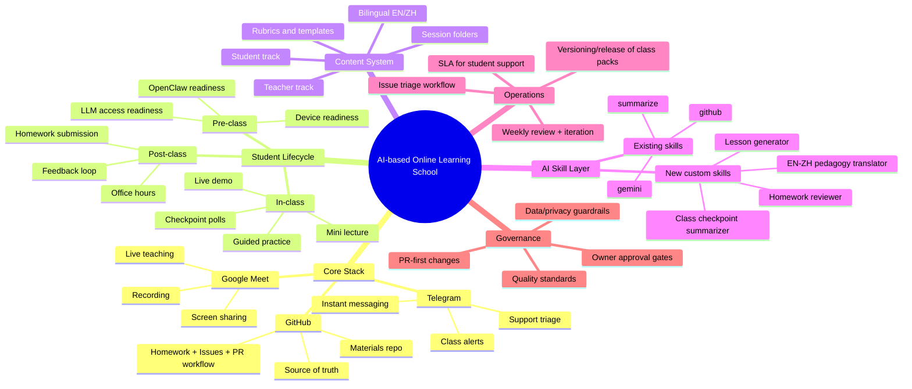

# Project Blueprint – AI‑based Online Learning School

## 1️⃣ Mermaid Mind Map (paste into GitHub Markdown)



---
## 2️⃣ Project Expansion – Epics → Tasks

### Epic A — Teaching Delivery Operating System
- **A1.** Define live class runbook (before/during/after class)
- **A2.** Define demo protocol (happy path + failure recovery demo)
- **A3.** Define exercise protocol (timed labs + pass criteria)
- **A4.** Define in‑class issue triage protocol

### Epic B — Student Experience System
- **B1.** Pre‑class readiness checklist (technical + account + LLM)
- **B2.** Post‑class reinforcement loop template
- **B3.** Stuck protocol template (issue form)
- **B4.** Student progress tracker + status labels

### Epic C — Content Architecture
- **C1.** Standardize class content format (EN/ZH)
- **C2.** Build reusable lesson template (Class 1..N)
- **C3.** Build assignment template + rubric template
- **C4.** Build “teacher notes vs student handout” split pattern

### Epic D — GitHub Workflow + Automation
- **D1.** Issue templates (homework, blocker, improvement request)
- **D2.** PR templates (content update checklist)
- **D3.** Label taxonomy (student‑help, blocker, content‑update, etc.)
- **D4.** Milestones/sprints for release cadence

### Epic E — AI Skills Roadmap (school capability)
- **E1.** Skill matrix: current vs needed
- **E2.** Build Homework Feedback Skill (draft feedback + rubric mapping)
- **E3.** Build Lesson Pack Generator Skill (EN/ZH)
- **E4.** Build Class Insights Skill (summarize common student blockers)
- **E5.** Build AI change‑watch process (monthly update on new model/tool trends)

### Epic F — Quality + Future‑proofing
- **F1.** Define learning KPIs (completion, unblock time, capstone quality)
- **F2.** Monthly “curriculum freshness” review
- **F3.** Versioned releases of materials (v1.0, v1.1…)
- **F4.** Add new AI tools through controlled pilots

---
## 3️⃣ Suggested Assignment Split (Sarah lead, Aether assist)
- **Sarah lead:** Epics A, C, E (pedagogy, architecture, skill design)
- **Aether assist/execute:** Epics B, D, parts of E implementation
- **Randy approval/steer:** Milestones, priorities, release gates

---
## 4️⃣ First 2‑Week Execution Sprint (recommended)
### Week 1 – Foundation
- Finalize runbook + triage (A1‑A4)
- Finalize templates (B1‑B3, C1‑C3)
- Set up GitHub ops (D1‑D3)

### Week 2 – Automation + Iteration
- Draft skill matrix + first custom skill specs (E1‑E3)
- Pilot one class with full workflow
- Collect issues + patch pack v1.1

---
## 5️⃣ Next Step – Project Board Seed
If you’d like, I can generate a GitHub‑ready **Project Board** with issue titles, labels, assignees, and milestones ready for immediate use.
```
